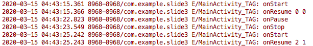
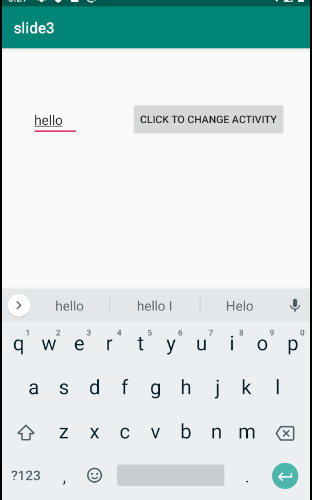

# Slide3_part1_maryam.vaez
This project demonstrate the lifestyles, saving/restoring the Activity State and controlling configuration:
There is a log message in each state of below that shows what is the status of MainActivity:
* onCreate
* onStart
* onResume
* onpause
* onStop

You can see the status of the MainActivity in the Logcat.

The 2 number written in front of the onResume is 2 parameter which are modified when the MainActivity is paused. So in second onResume the 2 parameter are modified.(saving/restoring the Activity State)

By running the project, there will be an EditBox and a Button. Write your message in the EditBox and send it by clicking the Button. As you see, your message will be shown in the other activity named DisplayMessageActivity. So the MainActivity is paused. If you get back from the DisplayMessageActivity, the MainActivity is resumed again.

